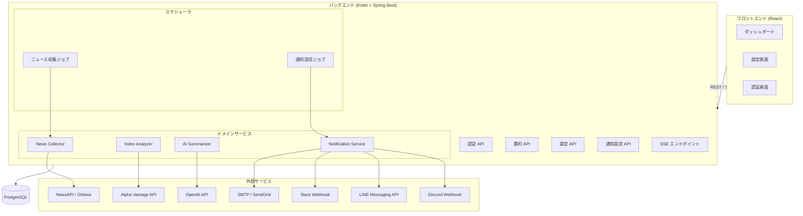
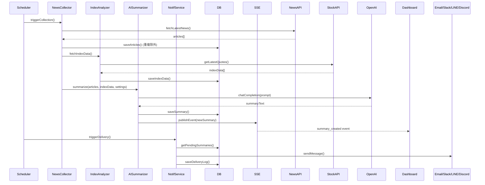
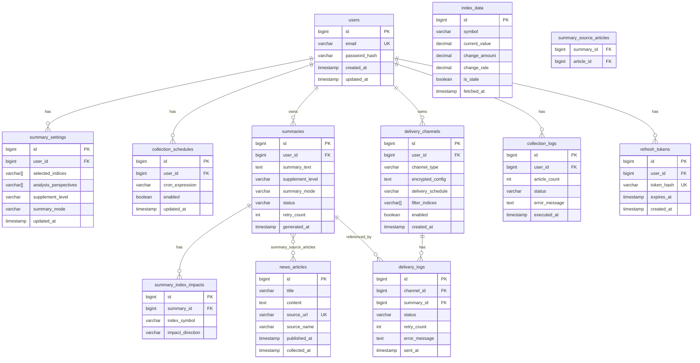

# 技術設計ドキュメント: Economic News AI Summarizer

## 概要

本ドキュメントは、世界の経済ニュースを自動収集し、株価指数の値動き要因と関連付けてAIが要約するWebアプリケーションの技術設計を定義する。

### システム目的

- 設定された時刻に経済ニュースを自動収集する
- LLM APIを用いてニュースを日本語で要約し、株価指数への影響を分析する
- 要約結果をReact管理画面で閲覧可能にし、メール・Slack・LINE・Discordへ配信する
- ユーザーごとに補足レベル・文字数モード・分析観点・送信先を設定可能にする

### 技術スタック

| レイヤー | 技術 |
|---|---|
| フロントエンド | React 18 + TypeScript, Vite, TanStack Query, Zustand |
| バックエンド | Kotlin 1.9 + Spring Boot 3.x |
| AI統合 | Spring AI (Anthropic Claude Sonnet ChatClient) |
| データベース | PostgreSQL 15 |
| スケジューリング | Spring `@Scheduled` + Quartz Scheduler |
| リアルタイム通知 | Server-Sent Events (SSE) |
| 認証 | Spring Security + JWT (jjwt) |
| メール送信 | Spring Mail (SMTP) / SendGrid API |
| Slack送信 | Slack Incoming Webhook (HTTP POST) |
| LINE送信 | LINE Messaging API |
| Discord送信 | Discord Webhook (HTTP POST) |
| 株価データ | Alpha Vantage API / Yahoo Finance API |
| ニュース収集 | NewsAPI / GNews API |
| 暗号化 | AES-256-GCM (JCE) |

---

## Agent Skills

本プロジェクトでは以下のAgent Skillsを参照する。スキルは `.kiro/skills/` に配置されており、Kiroが実装タスクを実行する際に自動的に活性化される。

| スキル | パス | 適用範囲 |
|---|---|---|
| `spring-boot-kotlin` | `.kiro/skills/spring-boot-kotlin/` | バックエンド全般。Spring Boot 3.x + Kotlin のレイヤー構成、DI、エラーハンドリング |
| `react-typescript` | `.kiro/skills/react-typescript/` | フロントエンド全般。React 18 + TypeScript + Vite SPA のコンポーネント設計・状態管理・パフォーマンス最適化（Vercel react-best-practices ルールをSPA向けに適用） |
| `react-doctor` | `.kiro/skills/react-doctor/` | フロントエンドコード品質診断。60+ルールによるヘルスチェック、スコア75以上を目標とする |
| `spring-ai-integration` | `.kiro/skills/spring-ai-integration/` | AI要約機能。Spring AI の `ChatClient` を使ったプロンプト設計、リトライ、コスト最適化 |
| `postgresql-jpa` | `.kiro/skills/postgresql-jpa/` | データ層全般。JPA エンティティ設計、リポジトリパターン、トランザクション管理、マイグレーション |
| `junit5-property-testing` | `.kiro/skills/junit5-property-testing/` | プロパティベーステスト。JUnit5 + jqwik の `@Property`・`@ForAll`・`Arbitraries` による不変条件検証 |
| `linear-ui-skills` | `.kiro/skills/linear-ui-skills/` | ダッシュボード・管理画面のUI。ダークモード、Inter font、4pxグリッド、データ密度の高いレイアウト |
| `vercel-ui-skills` | `.kiro/skills/vercel-ui-skills/` | 設定画面・フォームのUI。ミニマルなライトモード、クリーンな白黒デザイン |
| `stripe-ui-skills` | `.kiro/skills/stripe-ui-skills/` | 株価指数・数値データ表示のUI。`tabular-nums`、上昇/下落カラートークン、データ密度の高い表示 |

### スキルの適用方針

- **`spring-boot-kotlin`**: `domain/`・`api/`・`infrastructure/` 配下のすべての Kotlin ファイル作成時に参照する
- **`react-typescript`**: `src/` 配下のすべての `.tsx`・`.ts` ファイル作成時に参照する。UIスキルと組み合わせて使用する
- **`react-doctor`**: フロントエンド実装タスク完了後に `npx -y react-doctor@latest .` を実行してコード品質を検証する
- **`spring-ai-integration`**: `AISummarizerService` および `SummaryPromptBuilder` の実装時に参照する
- **`postgresql-jpa`**: JPA エンティティ・リポジトリ・Flyway マイグレーションファイルの作成時に参照する
- **`junit5-property-testing`**: 設計ドキュメントの「正確性プロパティ」セクションに定義された9件のプロパティテスト実装時に参照する
- **`linear-ui-skills`**: `DashboardPage.tsx`・`SummaryList.tsx`・`SummaryCard.tsx`・`IndexTicker.tsx` 等のダッシュボード系コンポーネント実装時に参照する
- **`vercel-ui-skills`**: `SummarySettingsPage.tsx`・`NotificationSettingsPage.tsx`・`LoginPage.tsx` 等の設定・フォーム系コンポーネント実装時に参照する
- **`stripe-ui-skills`**: `IndexTicker.tsx` 等の株価指数・数値データ表示コンポーネント実装時に参照する（`tabular-nums`・上昇/下落カラーの適用）

### スキル選定の判断根拠

| 検討スキル | 採用判断 | 理由 |
|---|---|---|
| `react-typescript`（本プロジェクト作成） | ✅ 採用 | Vite SPA向けに Vercel react-best-practices ルールを適用・統合済み。Next.js固有ルールを除外 |
| `react-doctor`（millionco/react-doctor） | ✅ 採用 | 実装後の品質診断ツールとして活用。`react-typescript` と役割が異なり補完的 |
| `junit5-property-testing`（本プロジェクト作成） | ✅ 採用 | JUnit5 + jqwik を使用。Spring Boot との統合が容易 |
| `linear-ui-skills`（ihlamury/design-skills） | ✅ 採用 | ダークモードのダッシュボードUIに最適。Linear のデザインシステムはデータ密度の高い管理画面の定番 |
| `vercel-ui-skills`（ihlamury/design-skills） | ✅ 採用 | 設定画面のクリーンなライトモードUIに最適。ミニマルで視認性が高い |
| `stripe-ui-skills`（ihlamury/design-skills） | ✅ 採用 | 数値・金融データ表示に最適。`tabular-nums`・上昇/下落カラートークンが株価指数表示に直接使える |
| `kotest-property-testing` | ❌ 不採用 | Kotest は JUnit5 と異なるテストランナー。本プロジェクトは JUnit5 統一のため除外 |
| `ui-ux-pro-max-skill` | ❌ 不採用 | ランディングページ・マーケティングサイト向けが主体。管理画面には過剰かつPython依存あり |

---

## アーキテクチャ

### システム全体構成



### 処理フロー（ニュース収集〜通知）



### DDD（ドメイン駆動設計）構成

本プロジェクトはDDDの戦略的・戦術的パターンを採用する。ドメインロジックをインフラ・UIから分離し、ビジネスルールをドメイン層に集約する。

#### 境界づけられたコンテキスト（Bounded Context）

```
┌─────────────────────────────────────────────────────────────────┐
│  News Context          │  Summary Context   │  Notification     │
│  ニュース収集・管理     │  AI要約・設定管理  │  Context          │
│                        │                    │  通知送信・管理   │
├─────────────────────────────────────────────────────────────────┤
│  Index Context         │  User Context                          │
│  株価指数取得・管理     │  認証・認可・ユーザー管理              │
└─────────────────────────────────────────────────────────────────┘
```

#### パッケージ構成（DDD レイヤー）

```
com.example.economicnews
│
├── news/                           # News Context
│   ├── domain/
│   │   ├── model/
│   │   │   ├── NewsArticle.kt      # エンティティ（集約ルート）
│   │   │   ├── NewsArticleId.kt    # 値オブジェクト
│   │   │   └── CollectionLog.kt    # エンティティ
│   │   ├── repository/
│   │   │   └── NewsArticleRepository.kt  # リポジトリインターフェース
│   │   └── service/
│   │       └── NewsCollectorService.kt   # ドメインサービス
│   ├── application/
│   │   └── usecase/
│   │       └── CollectNewsUseCase.kt     # アプリケーションサービス
│   └── infrastructure/
│       ├── persistence/
│       │   ├── NewsArticleJpaEntity.kt
│       │   └── NewsArticleJpaRepository.kt
│       └── external/
│           └── NewsApiClient.kt          # 外部APIアダプタ
│
├── summary/                        # Summary Context
│   ├── domain/
│   │   ├── model/
│   │   │   ├── Summary.kt          # エンティティ（集約ルート）
│   │   │   ├── SummaryId.kt        # 値オブジェクト
│   │   │   ├── SummarySettings.kt  # 値オブジェクト
│   │   │   ├── SupplementLevel.kt  # 列挙型
│   │   │   ├── SummaryMode.kt      # 列挙型
│   │   │   ├── AnalysisPerspective.kt  # 列挙型
│   │   │   └── SummaryIndexImpact.kt   # 値オブジェクト
│   │   ├── repository/
│   │   │   └── SummaryRepository.kt
│   │   └── service/
│   │       ├── AISummarizerService.kt   # ドメインサービス
│   │       └── SummaryPromptBuilder.kt  # ドメインサービス
│   ├── application/
│   │   └── usecase/
│   │       ├── GenerateSummaryUseCase.kt
│   │       └── GetSummariesUseCase.kt
│   └── infrastructure/
│       ├── persistence/
│       │   ├── SummaryJpaEntity.kt
│       │   └── SummaryJpaRepository.kt
│       └── ai/
│           └── AnthropicChatClient.kt   # Spring AI アダプタ
│
├── index/                          # Index Context
│   ├── domain/
│   │   ├── model/
│   │   │   ├── IndexData.kt        # エンティティ（集約ルート）
│   │   │   └── StockSymbol.kt      # 値オブジェクト
│   │   ├── repository/
│   │   │   └── IndexDataRepository.kt
│   │   └── service/
│   │       └── IndexAnalyzerService.kt  # ドメインサービス
│   ├── application/
│   │   └── usecase/
│   │       └── FetchIndexDataUseCase.kt
│   └── infrastructure/
│       ├── persistence/
│       │   └── IndexDataJpaRepository.kt
│       └── external/
│           └── StockApiClient.kt
│
├── notification/                   # Notification Context
│   ├── domain/
│   │   ├── model/
│   │   │   ├── DeliveryChannel.kt  # エンティティ（集約ルート）
│   │   │   ├── DeliveryChannelId.kt
│   │   │   ├── ChannelType.kt      # 列挙型（EMAIL/SLACK/LINE/DISCORD）
│   │   │   ├── ChannelConfig.kt    # 値オブジェクト（暗号化設定）
│   │   │   └── DeliveryLog.kt      # エンティティ
│   │   ├── repository/
│   │   │   ├── DeliveryChannelRepository.kt
│   │   │   └── DeliveryLogRepository.kt
│   │   └── service/
│   │       └── NotificationService.kt   # ドメインサービス
│   ├── application/
│   │   └── usecase/
│   │       ├── SendNotificationUseCase.kt
│   │       └── ManageChannelUseCase.kt
│   └── infrastructure/
│       ├── persistence/
│       │   └── DeliveryChannelJpaRepository.kt
│       └── sender/
│           ├── EmailNotificationAdapter.kt
│           ├── SlackNotificationAdapter.kt
│           ├── LineNotificationAdapter.kt
│           └── DiscordNotificationAdapter.kt
│
├── user/                           # User Context
│   ├── domain/
│   │   ├── model/
│   │   │   ├── User.kt             # エンティティ（集約ルート）
│   │   │   ├── UserId.kt           # 値オブジェクト
│   │   │   └── RefreshToken.kt     # エンティティ
│   │   ├── repository/
│   │   │   ├── UserRepository.kt
│   │   │   └── RefreshTokenRepository.kt
│   │   └── service/
│   │       └── UserDomainService.kt
│   ├── application/
│   │   └── usecase/
│   │       ├── RegisterUserUseCase.kt
│   │       └── AuthenticateUserUseCase.kt
│   └── infrastructure/
│       ├── persistence/
│       │   └── UserJpaRepository.kt
│       └── security/
│           ├── JwtService.kt
│           └── EncryptionService.kt
│
├── shared/                         # 共有カーネル
│   ├── domain/
│   │   └── event/
│   │       ├── DomainEvent.kt      # ドメインイベント基底
│   │       └── NewsCollectedEvent.kt
│   └── infrastructure/
│       └── sse/
│           └── SsePublisher.kt
│
├── api/                            # プレゼンテーション層（REST）
│   ├── auth/
│   │   └── AuthController.kt
│   ├── summary/
│   │   └── SummaryController.kt
│   ├── settings/
│   │   └── SettingsController.kt
│   ├── notification/
│   │   └── NotificationController.kt
│   ├── index/
│   │   └── IndexController.kt
│   └── sse/
│       └── SseController.kt
│
└── scheduler/                      # スケジューラ層
    ├── NewsCollectionJob.kt
    └── NotificationDeliveryJob.kt
```

#### DDDの主要パターン適用方針

| パターン | 適用箇所 | 説明 |
|---|---|---|
| **集約（Aggregate）** | `NewsArticle`・`Summary`・`DeliveryChannel`・`User` | 各コンテキストの集約ルート。トランザクション境界を定義 |
| **値オブジェクト（Value Object）** | `SummarySettings`・`StockSymbol`・`ChannelConfig`・`SummaryIndexImpact` | 不変・同一性なし。ビジネスルールをカプセル化 |
| **ドメインサービス（Domain Service）** | `NewsCollectorService`・`AISummarizerService`・`NotificationService` | 複数集約にまたがるビジネスロジック |
| **アプリケーションサービス（Use Case）** | `CollectNewsUseCase`・`GenerateSummaryUseCase` 等 | ユースケース単位のオーケストレーション。トランザクション管理 |
| **リポジトリ（Repository）** | 各コンテキストの `*Repository` インターフェース | ドメイン層に定義、インフラ層で実装（依存性逆転） |
| **ドメインイベント（Domain Event）** | `NewsCollectedEvent` | ニュース収集完了 → AI要約トリガーの疎結合連携 |
| **アンチコラプションレイヤー（ACL）** | `NewsApiClient`・`StockApiClient`・`AnthropicChatClient` | 外部APIをドメインモデルに変換するアダプタ |

### レイヤー間の依存関係

```
プレゼンテーション層（api/）
        ↓ 依存
アプリケーション層（application/usecase/）
        ↓ 依存
ドメイン層（domain/model, domain/service, domain/repository）
        ↑ 実装（依存性逆転）
インフラ層（infrastructure/）
```

- ドメイン層は他のどの層にも依存しない
- インフラ層はドメイン層のリポジトリインターフェースを実装する
- アプリケーション層はドメインサービスとリポジトリを組み合わせてユースケースを実現する

### ドメインドキュメント方針

各ドメインディレクトリに `README.md` を配置し、以下の内容を記録する。実装が進むたびに対応するmdファイルを更新し、コードと設計ドキュメントの乖離を防ぐ。

#### 配置場所

```
backend/src/main/kotlin/com/example/economicnews/domain/
├── user/README.md
├── news/README.md
├── index/README.md
├── summary/README.md
├── notification/README.md
└── settings/README.md
```

#### 記載内容

各 `README.md` には以下を記載する：

1. **ドメイン概要** — 境界コンテキストの責務と対応する要件番号
2. **クラス一覧** — model/repository/service 配下のクラスと役割
3. **機能別処理フロー** — 機能単位のシーケンス（呼び出し元 → ドメインサービス → リポジトリ → 外部アダプタ）
4. **関連クラス** — 他ドメインとの依存関係・ドメインイベント連携
5. **設計判断** — DDDパターンの適用理由・トレードオフ

#### 更新ルール

- 新しいクラスを追加したら、対応するドメインの `README.md` にクラス一覧を更新する
- 新しい機能（ユースケース）を実装したら、処理フローを追記する
- コミット時にドメインmdファイルの更新を含める

---

## コンポーネントとインターフェース

### バックエンド REST API

#### 認証 API

| メソッド | パス | 説明 |
|---|---|---|
| POST | `/api/v1/auth/register` | ユーザー登録 |
| POST | `/api/v1/auth/login` | ログイン・JWT発行 |
| POST | `/api/v1/auth/refresh` | アクセストークン更新 |

#### 要約 API

| メソッド | パス | 説明 |
|---|---|---|
| GET | `/api/v1/summaries` | 要約一覧（ページネーション・フィルタ） |
| GET | `/api/v1/summaries/{id}` | 要約詳細 |
| GET | `/api/v1/summaries/stream` | SSE ストリーム（リアルタイム更新） |

#### 設定 API

| メソッド | パス | 説明 |
|---|---|---|
| GET | `/api/v1/settings/summary` | 要約設定取得 |
| PUT | `/api/v1/settings/summary` | 要約設定更新 |
| GET | `/api/v1/settings/schedule` | 収集スケジュール取得 |
| PUT | `/api/v1/settings/schedule` | 収集スケジュール更新 |

#### 通知設定 API

| メソッド | パス | 説明 |
|---|---|---|
| GET | `/api/v1/channels` | 送信チャンネル一覧 |
| POST | `/api/v1/channels` | チャンネル追加 |
| PUT | `/api/v1/channels/{id}` | チャンネル更新 |
| DELETE | `/api/v1/channels/{id}` | チャンネル削除 |
| POST | `/api/v1/channels/{id}/test` | 接続テスト |

#### 株価指数 API

| メソッド | パス | 説明 |
|---|---|---|
| GET | `/api/v1/indices` | 最新株価指数データ一覧 |

### 主要サービスインターフェース（Kotlin）

```kotlin
// ニュース収集
interface NewsCollectorService {
    fun collectNews(): CollectionResult
    fun isDuplicate(article: NewsArticle): Boolean
}

// 株価指数取得
interface IndexAnalyzerService {
    fun fetchLatestIndices(symbols: List<StockSymbol>): List<IndexData>
    fun getCachedIndices(symbols: List<StockSymbol>): List<IndexData>
}

// AI要約生成
interface AISummarizerService {
    fun summarize(
        articles: List<NewsArticle>,
        indices: List<IndexData>,
        settings: SummarySettings
    ): Summary
    fun retryFailedSummaries()
}

// 通知送信
interface NotificationService {
    fun sendToChannel(summary: Summary, channel: DeliveryChannel): DeliveryResult
    fun sendToChannels(summary: Summary, channels: List<DeliveryChannel>): List<DeliveryResult>
    fun retryFailedDeliveries()
}

// SSEイベント発行
interface SsePublisher {
    fun publishSummaryCreated(summary: SummaryDto)
    fun subscribe(userId: Long): SseEmitter
}
```

### Spring AI プロンプト設計

AI要約生成には Spring AI の `ChatClient` を使用する。プロンプトはユーザー設定（補足レベル・文字数モード・分析観点）に基づいて動的に構築する。

```kotlin
// プロンプトビルダー（概念）
class SummaryPromptBuilder {
    fun build(
        articles: List<NewsArticle>,
        indices: List<IndexData>,
        settings: SummarySettings
    ): String {
        val levelInstruction = when (settings.supplementLevel) {
            BEGINNER -> "経済の基本的な因果関係（例：金利上昇→借入コスト増加→企業収益圧迫→株価下落）を含めて説明してください。"
            INTERMEDIATE -> "基本的な因果関係の説明は省略し、指数への影響分析と市場背景を中心に説明してください。"
            ADVANCED -> "因果関係や用語説明を省略し、指数への影響と要因の簡潔な分析のみを記述してください。"
        }
        val charLimit = when (settings.summaryMode) {
            SHORT -> 150
            STANDARD -> 300
            DETAILED -> 600
        }
        val glossaryInstruction = if (settings.supplementLevel != ADVANCED) {
            "要約末尾に「用語解説」セクションを付加し、登場した専門用語を【用語名】: 説明文（50文字以内）の形式で記載してください。専門用語がない場合は省略してください。"
        } else ""
        // ... プロンプト組み立て
    }
}
```

### フロントエンドコンポーネント構成

```
src/
├── pages/
│   ├── LoginPage.tsx
│   ├── DashboardPage.tsx
│   ├── SummarySettingsPage.tsx
│   └── NotificationSettingsPage.tsx
├── components/
│   ├── summary/
│   │   ├── SummaryList.tsx
│   │   ├── SummaryCard.tsx
│   │   └── SummaryFilter.tsx
│   ├── index/
│   │   └── IndexTicker.tsx
│   └── settings/
│       ├── SummarySettingsForm.tsx
│       ├── ChannelSettingsForm.tsx
│       └── ChannelMultiSelector.tsx   # 複数送信先選択UI
├── hooks/
│   ├── useSummaries.ts       # TanStack Query
│   ├── useSseStream.ts       # SSE購読
│   └── useIndexData.ts
└── store/
    └── settingsStore.ts      # Zustand
```

SSEによるリアルタイム更新は `useSseStream` フックで管理し、新しい要約が生成されると TanStack Query のキャッシュを無効化して自動再取得する。

---

## データモデル

### ERダイアグラム



### 主要エンティティ詳細

#### `summaries.status` 列挙値
- `PENDING` - 要約待ち
- `IN_PROGRESS` - 要約中
- `COMPLETED` - 完了
- `FAILED` - 失敗（最大3回リトライ後）

#### `summary_settings.supplement_level` 列挙値
- `BEGINNER` - 初心者向け
- `INTERMEDIATE` - 中級者向け
- `ADVANCED` - 上級者向け

#### `summary_settings.summary_mode` 列挙値
- `SHORT` - 短め（150文字以内）
- `STANDARD` - 標準（300文字以内）
- `DETAILED` - 詳細（600文字以内）

#### `delivery_channels.channel_type` 列挙値
- `EMAIL`
- `SLACK`
- `LINE`
- `DISCORD`

#### `delivery_channels.encrypted_config` JSON構造（復号後）
```json
// EMAIL
{ "smtpHost": "...", "smtpPort": 587, "username": "...", "password": "...", "toAddress": "..." }
// SLACK
{ "webhookUrl": "https://hooks.slack.com/..." }
// LINE
{ "channelAccessToken": "...", "userId": "..." }
// DISCORD
{ "webhookUrl": "https://discord.com/api/webhooks/..." }
```

#### `summary_settings.analysis_perspectives` 選択肢
```
INTEREST_RATE, GEOPOLITICAL_RISK, INFLUENTIAL_SPEECH,
CORPORATE_EARNINGS, FOREX_POLICY, ENERGY_RESOURCES,
INFLATION_CPI, EMPLOYMENT_STATS, CUSTOM
```

---

## 正確性プロパティ

*プロパティとは、システムのすべての有効な実行において真であるべき特性または振る舞いのことである。プロパティは人間が読める仕様と機械検証可能な正確性保証の橋渡しをする。*

### プロパティ 1: ニュース記事の重複排除

*任意の* ニュース記事コレクションに対して、同一のソースURLまたは同一タイトルを持つ記事を複数回保存しようとした場合、データベースには1件のみ保存されること

**検証対象: 要件 1.5**

### プロパティ 2: 要約文字数制約

*任意の* 有効なニュース記事セットと設定に対して、AI要約生成後の要約本文の文字数は、設定された文字数モード（SHORT: 150字、STANDARD: 300字、DETAILED: 600字）の上限を超えないこと

**検証対象: 要件 3.4, 9.6**

### プロパティ 3: 上級者向け設定での用語解説省略

*任意の* ニュース記事セットに対して、補足レベルが「上級者向け（ADVANCED）」に設定されている場合、生成された要約テキストに「用語解説」セクションが含まれないこと

**検証対象: 要件 3.12**

### プロパティ 4: 用語解説の文字数制約

*任意の* 要約テキストに対して、用語解説セクションが存在する場合、各用語解説項目の説明文は50文字以内であること

**検証対象: 要件 3.10**

### プロパティ 5: 通知送信ログの完全性

*任意の* 送信チャンネルと要約の組み合わせに対して、送信処理（成功・失敗を問わず）が実行された場合、必ず対応する送信ログレコードがデータベースに記録されること

**検証対象: 要件 5.7**

### プロパティ 6: 接続情報の暗号化保存

*任意の* Delivery_Channel 設定に対して、データベースに保存された `encrypted_config` フィールドの値は、平文のAPIキーやWebhook URLを含まないこと（AES-256-GCM暗号化済みであること）

**検証対象: 要件 6.6**

### プロパティ 7: 要約設定の反映

*任意の* 要約設定（Stock_Index選択・分析観点・補足レベル・文字数モード）に対して、設定保存後に生成された要約は、保存された設定の全パラメータを反映していること

**検証対象: 要件 9.7, 9.8**

### プロパティ 8: JWT認証の排他性

*任意の* APIリクエストに対して、有効なJWTトークンが含まれない場合、保護されたエンドポイントはHTTPステータスコード401を返し、データを返さないこと

**検証対象: 要件 7.4, 8.3**

### プロパティ 9: レート制限の一貫性

*任意の* クライアントIPアドレスに対して、1分間に60回を超えるAPIリクエストが送信された場合、超過分のリクエストはすべてHTTPステータスコード429を返すこと

**検証対象: 要件 8.5**

---

## エラーハンドリング

### エラー分類と対応方針

| エラー種別 | 対応方針 |
|---|---|
| ニュースAPI接続失敗 | エラーログ記録、他ソースの収集継続（要件 1.4） |
| 株価データAPI失敗 | キャッシュデータを返却、`is_stale=true` フラグ付与（要件 2.3） |
| LLM API失敗 | ステータス `FAILED` 保存、最大3回リトライ（要件 3.13, 3.14） |
| 通知送信失敗 | エラーログ記録、最大3回リトライ（要件 5.5） |
| 3回リトライ後も失敗 | ユーザーへ送信失敗通知（要件 5.6） |
| バックエンドAPI接続失敗（フロント） | エラーメッセージ表示、最終取得データ維持（要件 4.8） |
| 無効な認証情報 | 401返却、アカウント情報非開示（要件 7.3） |
| ログイン5回失敗 | 15分間IPブロック（要件 7.7） |
| 無効なチャンネル設定 | 具体的エラーメッセージ表示、設定保存しない（要件 6.5） |

### リトライ戦略

LLM APIおよび通知送信のリトライには指数バックオフを採用する。

```kotlin
// リトライ設定（概念）
val retrySpec = RetrySpec.backoff(maxAttempts = 3, minBackoff = Duration.ofSeconds(2))
    .filter { it is LlmApiException || it is NotificationException }
```

### グローバル例外ハンドラ

Spring の `@ControllerAdvice` を使用し、以下の統一エラーレスポンス形式を返す。

```json
{
  "timestamp": "2024-01-15T08:00:00Z",
  "status": 400,
  "error": "Bad Request",
  "message": "具体的なエラーメッセージ",
  "path": "/api/v1/channels"
}
```

---

## テスト戦略

### テストアプローチ

本システムはビジネスロジック（重複排除・文字数制御・用語解説付加・暗号化・認証）に対してプロパティベーステストを適用し、外部サービス連携（NewsAPI・株価API・LLM API・通知送信）に対してはモックを用いた統合テストを適用する。

**テストフレームワーク統一方針**: バックエンドはすべて **JUnit5** を使用する。プロパティベーステストには JUnit Platform 上で動作する **jqwik** を採用する。

### ユニットテスト（JUnit5 + Mockito）

- `NewsCollectorService`: 重複判定ロジック、収集ログ記録
- `AISummarizerService`: プロンプトビルダー、用語解説付加ロジック
- `NotificationService`: チャンネル別メッセージフォーマット
- `EncryptionService`: 暗号化・復号ラウンドトリップ
- `JwtService`: トークン生成・検証・有効期限チェック
- `RateLimiter`: リクエストカウント・ブロック判定

### プロパティベーステスト（JUnit5 + jqwik）

プロパティベーステストには **[jqwik](https://jqwik.net/)** を使用する（JUnit Platform 上で動作し、Spring Boot との統合が容易）。各プロパティテストは最低100回のイテレーションを実行する（`@Property(tries = 100)`）。

各テストには以下の形式でタグを付与する:
`Feature: economic-news-ai-summarizer, Property {番号}: {プロパティ内容}`

#### プロパティ 1: ニュース記事の重複排除
```kotlin
// Feature: economic-news-ai-summarizer, Property 1: 重複排除
@Property(tries = 100)
fun `重複URLは保存されない`(
    @ForAll @UniqueElements @Size(min = 1, max = 50) urls: List<@StringLength(min = 10) String>
) {
    val articles = urls.map { buildArticle(sourceUrl = it) }
    val saved = newsCollectorService.saveArticles(articles)
    assertThat(saved.map { it.sourceUrl }.distinct()).hasSameSizeAs(saved)
}
```

#### プロパティ 2: 要約文字数制約
```kotlin
// Feature: economic-news-ai-summarizer, Property 2: 文字数制約
@Property(tries = 100)
fun `要約本文は設定モードの上限を超えない`(
    @ForAll("newsArticles") article: NewsArticle,
    @ForAll summaryMode: SummaryMode
) {
    val summary = aiSummarizerService.summarize(listOf(article), settings.copy(summaryMode = summaryMode))
    assertThat(extractBody(summary.summaryText).length).isLessThanOrEqualTo(summaryMode.charLimit)
}
```

#### プロパティ 3: 上級者向け設定での用語解説省略
```kotlin
// Feature: economic-news-ai-summarizer, Property 3: 上級者向け用語解説省略
@Property(tries = 100)
fun `上級者向け設定では用語解説セクションが付加されない`(
    @ForAll("newsArticles") article: NewsArticle
) {
    val summary = aiSummarizerService.summarize(listOf(article), settings.copy(supplementLevel = ADVANCED))
    assertThat(summary.summaryText).doesNotContain("用語解説")
}
```

#### プロパティ 4: 用語解説の文字数制約
```kotlin
// Feature: economic-news-ai-summarizer, Property 4: 用語解説文字数
@Property(tries = 100)
fun `用語解説の各項目は50文字以内`(
    @ForAll("newsArticles") article: NewsArticle
) {
    val summary = aiSummarizerService.summarize(listOf(article), settings.copy(supplementLevel = BEGINNER))
    extractGlossaryItems(summary.summaryText).forEach { item ->
        assertThat(item.description.length).isLessThanOrEqualTo(50)
    }
}
```

#### プロパティ 5: 通知送信ログの完全性
```kotlin
// Feature: economic-news-ai-summarizer, Property 5: 送信ログ完全性
@Property(tries = 100)
fun `送信処理後は必ずログが記録される`(
    @ForAll("channels") channel: DeliveryChannel,
    @ForAll("summaries") summary: Summary
) {
    notificationService.sendToChannel(summary, channel)
    val log = deliveryLogRepository.findByChannelIdAndSummaryId(channel.id!!, summary.id!!)
    assertThat(log).isNotNull
    assertThat(log!!.status).isIn("SUCCESS", "FAILED")
}
```

#### プロパティ 6: 接続情報の暗号化保存
```kotlin
// Feature: economic-news-ai-summarizer, Property 6: 暗号化保存
@Property(tries = 100)
fun `DBに保存された接続情報は平文を含まない`(
    @ForAll("channelConfigs") config: ChannelConfig
) {
    val saved = channelRepository.save(buildChannel(config))
    val raw = jdbcTemplate.queryForObject(
        "SELECT encrypted_config FROM delivery_channels WHERE id = ?",
        String::class.java, saved.id
    )
    assertThat(raw).doesNotContain(config.webhookUrl ?: config.apiKey ?: "")
}
```

#### プロパティ 7: 要約設定の反映
```kotlin
// Feature: economic-news-ai-summarizer, Property 7: 設定反映
@Property(tries = 100)
fun `保存した設定が要約生成に反映される`(
    @ForAll summaryMode: SummaryMode,
    @ForAll supplementLevel: SupplementLevel
) {
    val settings = SummarySettings(summaryMode = summaryMode, supplementLevel = supplementLevel)
    settingsService.save(settings)
    val summary = aiSummarizerService.summarize(sampleArticles, settingsService.get())
    assertThat(summary.summaryMode).isEqualTo(summaryMode)
    assertThat(summary.supplementLevel).isEqualTo(supplementLevel)
}
```

#### プロパティ 8: JWT認証の排他性
```kotlin
// Feature: economic-news-ai-summarizer, Property 8: JWT認証排他性
@Property(tries = 100)
fun `無効なJWTトークンでは保護エンドポイントに401が返る`(
    @ForAll @StringLength(min = 1, max = 500) invalidToken: String
) {
    mockMvc.perform(
        get("/api/v1/summaries")
            .header("Authorization", "Bearer $invalidToken")
    ).andExpect(status().isUnauthorized)
}
```

#### プロパティ 9: レート制限の一貫性
```kotlin
// Feature: economic-news-ai-summarizer, Property 9: レート制限
@Property(tries = 50)
fun `60回超のリクエストは429を返す`(
    @ForAll @IntRange(min = 61, max = 100) requestCount: Int
) {
    repeat(requestCount) { i ->
        val result = mockMvc.perform(get("/api/v1/summaries").header("Authorization", "Bearer $validToken"))
        if (i >= 60) {
            result.andExpect(status().isTooManyRequests)
        }
    }
}
```

### 統合テスト（JUnit5 + Testcontainers + WireMock）

- ニュース収集ジョブのエンドツーエンド（NewsAPIモック使用）
- LLM API呼び出しとリトライ（OpenAIモック使用）
- 通知送信（Slack/LINE/Discord/Emailモック使用）
- スケジューラのCron式評価
- SSEストリームの接続・イベント受信

### フロントエンドテスト（Vitest + React Testing Library）

- コンポーネントの描画・インタラクションテスト
- SSEフックのモックテスト（MSW使用）
- 設定フォームのバリデーションテスト
- 実装完了後に `react-doctor` でコード品質スコア75以上を確認

### テスト環境

- バックエンド: Testcontainers（PostgreSQL）+ WireMock（外部API）
- フロントエンド: Vitest + MSW（APIモック）
